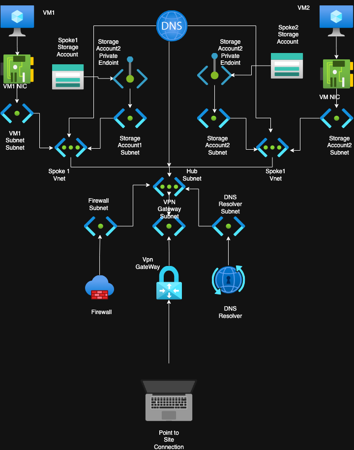

# 🚀 Azure Hub-Spoke Networking with VPN, Firewall, and Private Storage (Bicep)

This project deploys a **secure hub-and-spoke Azure network** using modular Bicep templates.  
The architecture integrates **VPN Gateway, Firewall, Private DNS Resolver, VNets, VMs, and Storage Accounts** with private endpoints.

---

## 🏗️ Architecture Overview

The solution follows the **Hub-Spoke model**:

- **Hub VNet** → central services (VPN Gateway, Firewall, Private DNS Resolver).
- **Spoke VNets** → application VNets hosting VMs and private storage accounts.
- **Peering** → connects hub to spokes for centralized routing and security.
- **Firewall** → secures egress/ingress traffic and enforces routing.
- **Private DNS + Private Endpoints** → ensures storage access stays internal.

---

## 📦 Modules and Interactions

### 1. Hub Network
- **Module:** `hub.bicep`  
- Creates the **hub VNet** with subnets for:
  - Gateway (`GatewaySubnet`)
  - Firewall
  - Private DNS Resolver  

All shared services are deployed here.

---

### 2. Private DNS Resolver
- **Module:** `private-dns-resolve.bicep`  
- Deployed in the hub.  
- Connects to spoke VNets via custom DNS settings.  
- Ensures that private endpoints (like `privatelink.blob.core.windows.net`) resolve internally.

---

### 3. VPN Gateway
- **Module:** `vpn-gateway.bicep`  
- Enables **Point-to-Site (P2S)** and/or **Site-to-Site (S2S)** connectivity.  
- Attached to the hub VNet (`GatewaySubnet`).  
- Acts as the entry point for external clients.

---

### 4. Routing
- **Module:** `routing-table.bicep` + `route-table-routes.bicep`  
- Default route (`0.0.0.0/0`) sends traffic to the **Firewall private IP**.  
- Spoke VNets associate with this route table to enforce central inspection.

---

### 5. Spoke VNets
- **Module:** `spoke.bicep`  
- Deploys **two spoke VNets** (`spoke1-vnet`, `spoke2-vnet`) with subnets:
  - `default` → VMs
  - `storage-account` → private endpoints  
- Uses **custom DNS** (hub DNS resolver + Azure + Google fallback).

---

### 6. Network Security
- **Module:** `nsg.bicep`  
- Applied to VM NICs for fine-grained access.  
- Works in tandem with the firewall for layered security.

---

### 7. Virtual Machines
- **Modules:** `nic.bicep` + `mv.bicep`  
- Each VM has:
  - A dedicated NIC bound to its spoke subnet and NSG.  
  - Configured with admin credentials (`azureuser / azureuser12345!`).  

---

### 8. VNet Peerings
- **Module:** `network-peering.bicep`  
- Connects each spoke to the hub VNet.  
- **Hub has VPN Gateway**, so peerings propagate gateway routes to spokes.

---

### 9. Firewall
- **Module:** `firewall.bicep`  
- Deployed in hub subnet with a public IP.  
- Rules:
  - Allow SSH on ports `22` and `222`.  
  - Allow outbound access as required.  
- Acts as **next hop** for all spoke traffic.

---

### 10. Public IP
- **Module:** `public-ip.bicep`  
- Provides a static public IP for the firewall.  

---

### 11. Private DNS Zone
- **Module:** `private-dns.bicep`  
- Zone: `privatelink.blob.core.windows.net`  
- Linked to hub + spoke VNets for storage resolution.

---

### 12. Storage Accounts
- **Module:** `storage-account.bicep`  
- Two storage accounts deployed, one per spoke (`learning10111`, `learning10112`).  
- Each uses **private endpoints** bound to the `storage-account` subnet.  
- Integrated with **Private DNS Zone** for name resolution.  

---

## 🔄 Flow of Interactions

1. **Client connects** via VPN Gateway → Hub.  
2. Traffic is routed through **Firewall** (central security).  
3. Firewall forwards allowed traffic → **Spoke VNets**.  
4. Spoke VMs communicate privately via hub DNS and firewall rules.  
5. Spoke workloads access **Storage Accounts** securely through **Private Endpoints**.  
6. DNS resolution for storage uses **Private DNS Resolver** and **Private DNS Zone**.  

---

## 📊 Diagram (Conceptual)

